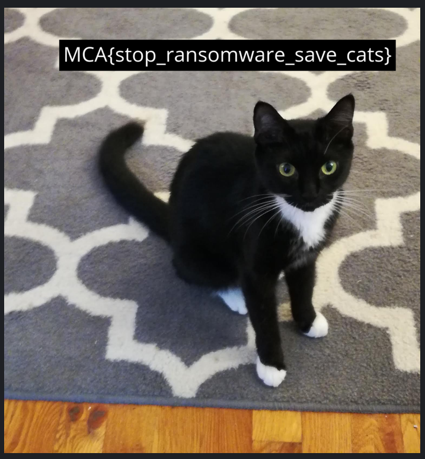

# STEM CTF: Cyber Challenge 2019

## Foreword

After solved re50, i jump directly to re300 because i was re Golang binary once before in root-me.org and pretty confident with it. But, it turns out i was falling to rabbit hole later...and lost 14 hours just fucking around...even though i was got everything in hand at first few hours...


## Ransomware

So, basically, the challenges give us two files 


One file is encrypted

The other is an ransomware, ELF binary


## Stripped Golang Binary

So, first thing first

```text
root@kali:~/Desktop/tmp/stem/re300# file goldfish-ransomware-sample.exe
goldfish-ransomware-sample.exe: ELF 64-bit LSB executable, x86-64, version 1 (SYSV), dynamically linked, interpreter /lib64/ld-linux-x86-64.so.2, Go BuildID=K5MarkX6W5LFVyFCqnx1/TP04sI2PJcI7YBPzhARp/65gzfdXiPRtlvJMwzxMx/3eBCF1Fja7XYglCZPIra, stripped
```

So it's stripped binary, which means : 


And golang binary contains tons of functions from tons of library, which now we dont even know any of thoses name


So the basic idea now is, we have to identify those functions, which, we have 2 ways to do so :

* Use tools to BinDiff like diaphora to identify those functions
* Generate/Find FLIRT database for Golang

But, i dont get lucky with those 2 options, it actually identified some functions, but there are still a lot

Luckily, i found this tool :

```text
https://github.com/sibears/IDAGolangHelper
```

Install, run and choose "Rename Functions" :


Result is pretty neat :


## Analysis

So, if you havent analyse an golang binary before, then, main\(\) function is in main\_main\(\)


So, firstly, the ransomware generate 24 random bytes from an hard coded bytes array and encode it by base64


This base64 string later become your key, which will be submitted to the C&C via POST request


So,  i just debug it to get the C&C url :


```text
https://docs.google.com/forms/d/e/1FAIpQLSd4VFZA8Cw7ednO-FzLqqesH6wd2z_bxs8-gg6L87kdVvKzkw/formResponse
```

The google forms was closed


So if you was reading blogs about those malwares that use google forms as C&C server, or, played around with google forms a bit, you may know that you just need to change url to :

```text
https://docs.google.com/forms/d/e/1FAIpQLSd4VFZA8Cw7ednO-FzLqqesH6wd2z_bxs8-gg6L87kdVvKzkw/viewanalytics
```

To see all requests/analytics


So, we can assume that one of those key is the key that encrypted our file, next we need to find an cipher that was used

The ransomware after sent an key to C&C, it will scan the directory


Where

```text
/tmp/safety-folder-18972910363797880709171295166015625
```

But the golang is not terminate string by NULL byte like in C, and there is other string next to our path in memory. So, we need to extract folder name string manually, which turns out to be

```text
/tmp/safety-folder-18972910
```

Then it check extension of file


By clicking to a1, we can see something like this


But it's actually an memory address, which is 0x68255b, which is lstat :


And check to see if the file is one of these extensions :


So i just create an folder with some file to test to see if it works


## Triple DES - CFB mode

This part actually cost a lot of time...


We can easily realize it use Triple DES - CFB mode to encrypt the file, we have the key, problem is i cannot find where it calculate the IV

So i wrote/got some samples program online, compile it and reverse to understand how things \(for, while, slice, array\) in golang works. For example

```text
https://www.socketloop.com/tutorials/golang-how-to-encrypt-and-decrypt-with-tripledes
```

Me and some friends in @ota was tried but no luck...golang sucks!

This is all in my notes that time


So i was trying to connect the dots, and this idea just pop out


By playing around with some triple des code above, i have an sense that the key will be first 8 chars of key

So i just wrote an quick python script to verify my idea

```python
import base64
import time
f = open('important-file.png.enc')
content = f.read()
f.close()
s =  '''d2HwMhfXlRx2Qt/0D92mRwPuHaTdfoy0
uC0yC0T45JYqzIL10l4QSVDIkMgeLWaB
+ZP4+IqQEz//1AQYrDU3xYYVkyWyQavD
n5MHHXyIcAa6Y2OjURoZpDfaOlGp25RF
EsxofQlPfvgCqKKQOzKGpsX11x07UC/o
PKCcZ5cMFMmB+W4vpHkhTvlFSNs7ufxE
vpuZUeG1ZqI0iuKKkRnIrqmM2ODLqbYu
N959M+gdQA9dsHR+qNIDJ+mmA9AmqFbE
97sh0qzO1rid2gYiEGfpDeAKNlOG6sRI
Ubs3cNHDaRSg//TCswkhnjhqyYsxMdUL
WI+DDhoCVnYPXzzDZS/mpTM6ZjKbfLl+
vQkmDE04cvaWuD+oSSLWqOl+L/P6JcyX
FnitjY+xCiUsmcJZFIfju0tJqxxmD8Ix
zaIXUY3pwaHEp5S1fyHQEV/+WDgC8qoD
a1SUzjT0Xvhb41gCxJvMXLsPclF7Ct8f
uDPJrKW4sZytCnfafEqqQG47BRZz1jzZ
JLBXCwNSyTWQ6Tw2WIoDnQBF9/y4JRf2
07qTl6X7aUkDahq2D0Za4n6DWd2e/7HV
ZOhw9d/k0DorBrBPs0d6EfqqO2xOGUeT
MFT2qERvcLJsWJFgoR2pfbjhhODrQyYf
y4+DZre1CxNhhTXrndBh2c3gfHy7YpV+
SGpomDrp+WhcZS/ZxxYER3VA4tQ5J/Pi
uCfuOHT+lFarv1S2jxHhIUOvl+ZP6/qc
PDbqfb29cuHOhJzC8rLUQO53nKXL/HL6
zsJZ3mnW7dV+3MuZn4zUKG8lTxqVabF0
8Bq1CmmFsiQQCZStvnsSvMbl9piDV0GQ
nmtEKrUIxRi8XdT2CaKHlD2SMsO75gdD
hSOx4NXJGxeduIoW86+DbOJn0k6JC8d2
y8j/HzFIQczGseJXeSqvM7x5HNU1b8Yj
K6tsM0MO5uXGdJpAGmwxz2V/H5x5ZJbv
3E37NBoqjgonhk/c7tsOTdprNRyivSvI
8jfofO4c4X6ibaOrk8MIi5C4AYQX24qv
D4ljQPVcqmX6PBW0wqV84kctKnGUBgs3
uhqRguMs9JWMrgDQy9j+8O2DT+QMALt+
PCK5TLxPiNv1avoljwNnbabyjLVgDPq1
wiMDaHFa2uIACAK4qv/feNfp+ioTXxb4
EOj7Z7qVpHQ36keyapnmbDiRp2EPLEgL
YJkekhPg0qwSHPeJVVqTrwmukGXt2kjo
DumNXMbedc8tz3FHEQYtbTSUmkETsg+3
pVYSXDvx9mOZmTfjvXtA3CrVv/LUdx0P
6AuGB6RITnkDJZBciVhc0lieNV/2ozNz
f4pk+DbN5Iz7UexW8jE8SGuNl2sin97f
99vIqrEXgDOf7fSeN8tTTWk6Jk/9g2nA
YlvBJwZMNVgIQo0xGE4SG5AMvrqfpJxf
6D4amfTmmcFRSkqy7LowkLHYI9r0E/HJ
O/dbHUC2QJPCyUlQ7r28P467NakyohcE
VeQtgBe0NE6SGBfJfZ6Nvct3+8oDhL+Q
YTif2Ye1Ai9gyB8SyzoyNhXsx7dEhFZ/'''

s = s.split('\n')
from Crypto.Cipher import DES3
from Crypto import Random

encrypted_text = base64.b64decode(content)
for key in s:
	key = base64.b64decode(key)
	iv = key[:8]
	cipher_decrypt = DES3.new(key, DES3.MODE_CFB, iv) #you can't reuse an object for encrypting or decrypting other data with the same key.
	output = cipher_decrypt.decrypt(encrypted_text)
	if output[0] == 'P':
		print output

```


No luck...At that moment, i thought that i was missing something when read code, so next 7-8 hours, i was trying to find the IV in code...but no one got any progress...the Go code is really sucks, flow, calling convention...was too much for my little brain...i was even tried something like :

```text
s = 'abc124209eu390wuer' //random shit
iv = s[:8]
fmt.Println(iv)
```

Even with that simple code, i couldnt find an iv after spend pretty much time on it.

So i was came back with my python script, double check, and i realize that python was fucked up the decryption


More information about that bullshit can be found here

```text
https://stackoverflow.com/questions/40004858/encrypt-in-python-and-decrypt-in-java-with-aes-cfb
```

## Decryption

So what's next?

Python is not working, so easiest way is to use the language created challenge to solve the challenge


Actually, golang is not that bad, and pretty easy to learn, like python



```go
package main
import "os"
import "crypto/cipher"
import "crypto/des"
//import "encoding/hex"
import b64 "encoding/base64"
import "fmt"
//import    "bufio"
//import    "io"
import    "io/ioutil"


func main() {
    b64key := os.Args[1]
    key, _ := b64.StdEncoding.DecodeString(b64key)
    d, _ := ioutil.ReadFile(os.Args[2])
    ciphertext, _ := b64.URLEncoding.DecodeString(string(d))
    block, err := des.NewTripleDESCipher(key)
    if err != nil {
      panic(err)
    }
    iv := ciphertext[:8]
    ciphertext = ciphertext[8:]
    stream := cipher.NewCFBDecrypter(block, iv)
    stream.XORKeyStream(ciphertext, ciphertext)
    fmt.Printf("%s", ciphertext)
}

```





```python
import os
s =  '''d2HwMhfXlRx2Qt/0D92mRwPuHaTdfoy0
uC0yC0T45JYqzIL10l4QSVDIkMgeLWaB
+ZP4+IqQEz//1AQYrDU3xYYVkyWyQavD
n5MHHXyIcAa6Y2OjURoZpDfaOlGp25RF
EsxofQlPfvgCqKKQOzKGpsX11x07UC/o
PKCcZ5cMFMmB+W4vpHkhTvlFSNs7ufxE
vpuZUeG1ZqI0iuKKkRnIrqmM2ODLqbYu
N959M+gdQA9dsHR+qNIDJ+mmA9AmqFbE
97sh0qzO1rid2gYiEGfpDeAKNlOG6sRI
Ubs3cNHDaRSg//TCswkhnjhqyYsxMdUL
WI+DDhoCVnYPXzzDZS/mpTM6ZjKbfLl+
vQkmDE04cvaWuD+oSSLWqOl+L/P6JcyX
FnitjY+xCiUsmcJZFIfju0tJqxxmD8Ix
zaIXUY3pwaHEp5S1fyHQEV/+WDgC8qoD
a1SUzjT0Xvhb41gCxJvMXLsPclF7Ct8f
uDPJrKW4sZytCnfafEqqQG47BRZz1jzZ
JLBXCwNSyTWQ6Tw2WIoDnQBF9/y4JRf2
07qTl6X7aUkDahq2D0Za4n6DWd2e/7HV
ZOhw9d/k0DorBrBPs0d6EfqqO2xOGUeT
MFT2qERvcLJsWJFgoR2pfbjhhODrQyYf
y4+DZre1CxNhhTXrndBh2c3gfHy7YpV+
SGpomDrp+WhcZS/ZxxYER3VA4tQ5J/Pi
uCfuOHT+lFarv1S2jxHhIUOvl+ZP6/qc
PDbqfb29cuHOhJzC8rLUQO53nKXL/HL6
zsJZ3mnW7dV+3MuZn4zUKG8lTxqVabF0
8Bq1CmmFsiQQCZStvnsSvMbl9piDV0GQ
nmtEKrUIxRi8XdT2CaKHlD2SMsO75gdD
hSOx4NXJGxeduIoW86+DbOJn0k6JC8d2
y8j/HzFIQczGseJXeSqvM7x5HNU1b8Yj
K6tsM0MO5uXGdJpAGmwxz2V/H5x5ZJbv
3E37NBoqjgonhk/c7tsOTdprNRyivSvI
8jfofO4c4X6ibaOrk8MIi5C4AYQX24qv
D4ljQPVcqmX6PBW0wqV84kctKnGUBgs3
uhqRguMs9JWMrgDQy9j+8O2DT+QMALt+
PCK5TLxPiNv1avoljwNnbabyjLVgDPq1
wiMDaHFa2uIACAK4qv/feNfp+ioTXxb4
EOj7Z7qVpHQ36keyapnmbDiRp2EPLEgL
YJkekhPg0qwSHPeJVVqTrwmukGXt2kjo
DumNXMbedc8tz3FHEQYtbTSUmkETsg+3
pVYSXDvx9mOZmTfjvXtA3CrVv/LUdx0P
6AuGB6RITnkDJZBciVhc0lieNV/2ozNz
f4pk+DbN5Iz7UexW8jE8SGuNl2sin97f
99vIqrEXgDOf7fSeN8tTTWk6Jk/9g2nA
YlvBJwZMNVgIQo0xGE4SG5AMvrqfpJxf
6D4amfTmmcFRSkqy7LowkLHYI9r0E/HJ
O/dbHUC2QJPCyUlQ7r28P467NakyohcE
VeQtgBe0NE6SGBfJfZ6Nvct3+8oDhL+Q
YTif2Ye1Ai9gyB8SyzoyNhXsx7dEhFZ/'''

s = s.split('\n')
count = 0
for key in s:
    os.system("./solver " + key + " secret.enc > out" + str(count) + ".png")
    count += 1

```



And finally we got flag






```text
MCA{stop_ransomware_save_cats}
```




## Update

AES CFB mode use first block as IV


